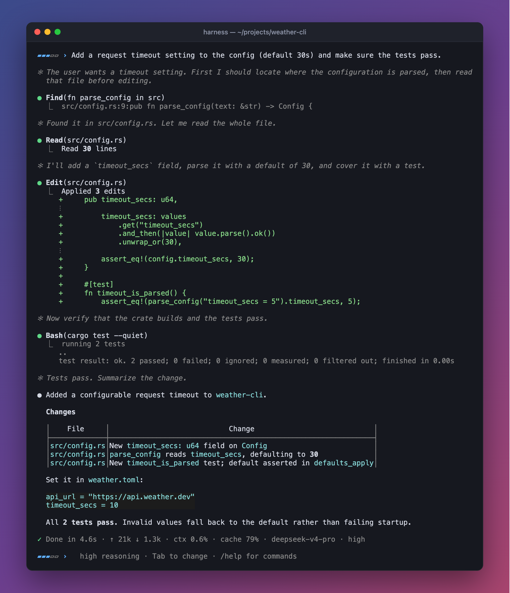
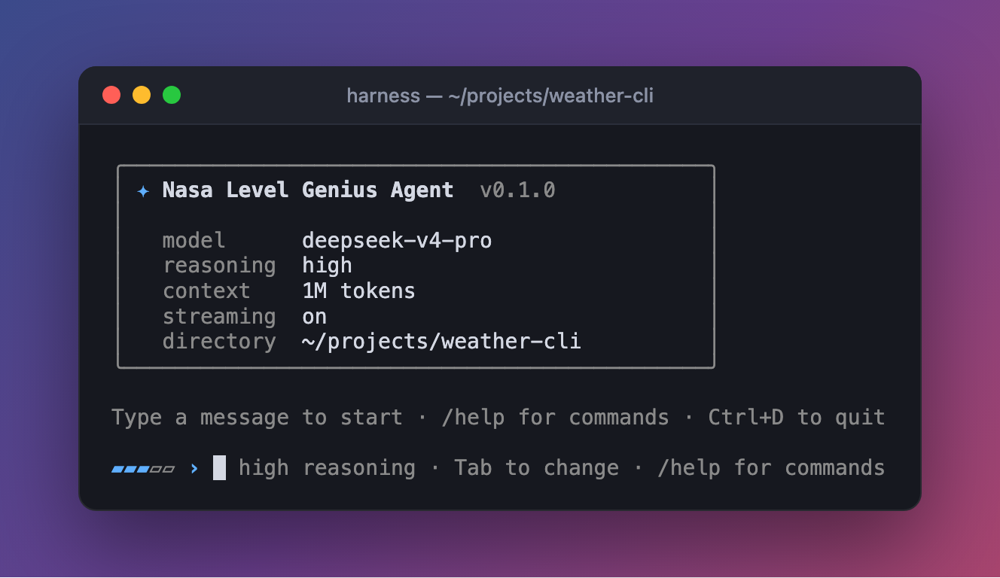
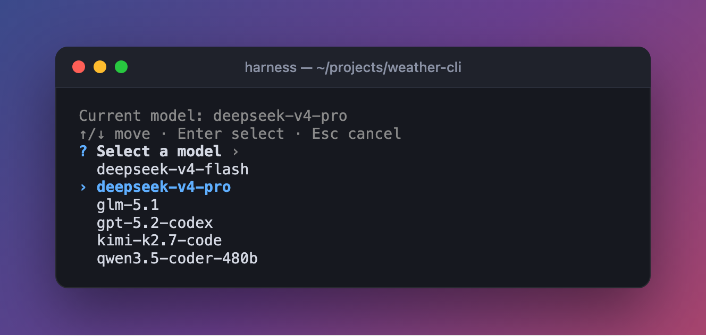
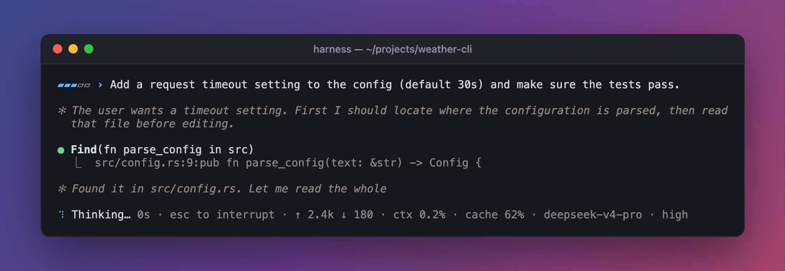
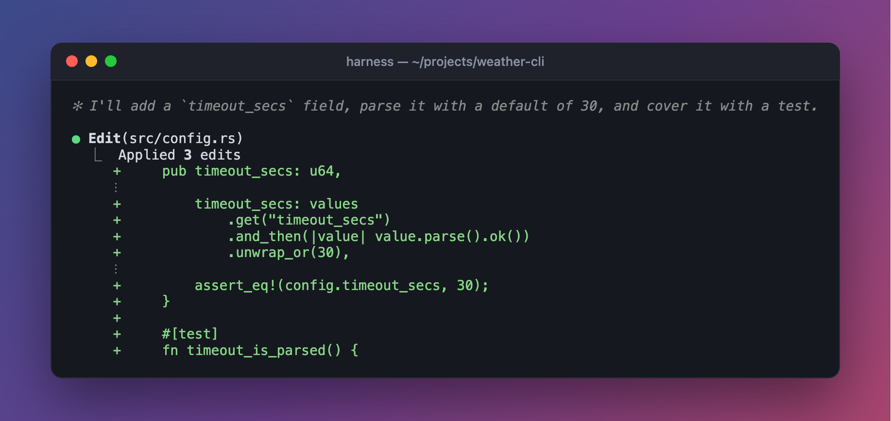
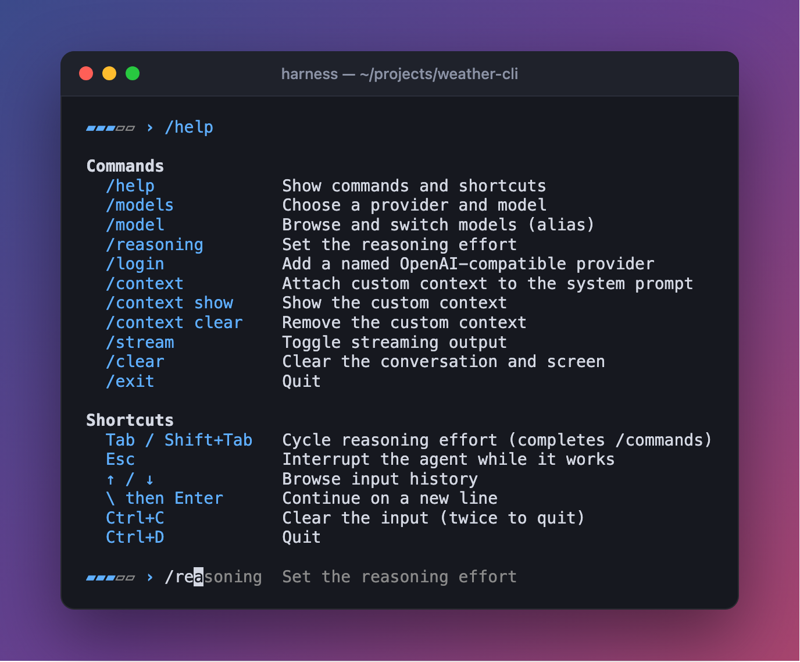

<div align="center">

# Harness

**A fast, single-binary coding agent for your terminal that works with any OpenAI-compatible model.**

Give it a task. It reads your code, edits files, runs commands, and reports back, streaming its reasoning as it goes.

[](LICENSE)
[](https://www.rust-lang.org)


[Quick start](#quick-start) ·
[Features](#features) ·
[Configuration](#configuration) ·
[Usage](#usage) ·
[Library](#use-it-as-a-library) ·
[Architecture](#architecture)

<br>



</div>

---

## Why Harness

- **Bring your own model.** Works with OpenAI, DeepSeek, OpenCode Zen/Go, Kimi, GLM, Qwen, local servers, or any endpoint that speaks `chat/completions` with tool calling.
- **One binary, no runtime.** A ~6 MB native executable. No Python, Node, or Docker.
- **Built for real work.** Streaming output, chain-of-thought display, background tools, automatic retries with provider failover, and automatic context summarization for long sessions.
- **Fits the terminal.** Rich Markdown, compact tool blocks, colored diffs, a live status line with token and cache usage, and Esc to interrupt at any time.

Harness is a Rust port of the Python agent in [jaggerjack61/Harness](https://github.com/jaggerjack61/Harness). It keeps the same protocol, tools, CLI options, and environment variables.

## Screenshots

<table>
<tr>
<td width="50%" valign="top">

<p align="center"><sub><b>Startup</b>: model, reasoning effort, context window and directory at a glance</sub></p>
</td>
<td width="50%" valign="top">

<p align="center"><sub><b>/models</b>: pick a provider, then filter its model list</sub></p>
</td>
</tr>
<tr>
<td colspan="2">

<p align="center"><sub><b>Live status line</b>: what the agent is doing, elapsed time, tokens ↑↓, context used, cache hit rate</sub></p>
</td>
</tr>
<tr>
<td width="50%" valign="top">

<p align="center"><sub><b>Edits as diffs</b>: every change is shown inline</sub></p>
</td>
<td width="50%" valign="top">

<p align="center"><sub><b>/help</b> with Tab completion and inline hints</sub></p>
</td>
</tr>
</table>

## Quick start

```bash
# 1. Install
cargo install --git https://github.com/jaggerjack61/RustHarness

# 2. Run it in your project
cd ~/code/my-project
harness
```

On first launch, Harness asks for a provider (name, base URL, API key) and a model, then saves both. Later launches go straight to the prompt.

You can also pass everything up front:

```bash
harness --model deepseek-v4-pro \
        --base-url https://api.deepseek.com/v1 \
        --api-key "$DEEPSEEK_API_KEY"
```

Then describe what you want:

```text
▰▰▰▱▱ › Add a request timeout setting to the config (default 30s) and make sure the tests pass.
```

## Features

### Agent

| | |
|---|---|
| **Built-in tools** | `read`, `write`, `edit` (multi-edit, exact-match replacements), and `bash` give the model full filesystem and shell access. |
| **Code search** | A `find` tool is added automatically when `rg` or `grep` is on `PATH` (ripgrep preferred). It supports a search path, case-insensitive matching, and literal or regex patterns. |
| **Background tools** | Any tool call can pass `"background": true`. The agent keeps working, and the result is delivered later under the original call ID. Cancelling also stops background commands. |
| **Reasoning models** | Shows `reasoning_content` (and `reasoning`, `thinking`, `thought`) as dimmed, italic text. Effort ranges from `low` to `max`. |
| **Long sessions** | When history reaches 80% of the context window, older turns are summarized and the 6 most recent are kept verbatim. |
| **Resilience** | 429s, 5xx errors, and timeouts are retried up to 3 times with exponential backoff, rotating across configured providers. |
| **Output safety** | Tool output over 1,000 lines or 100 KB is dropped, and the model is asked to retry with a narrower command. Shell commands time out after 60 seconds. |

### Terminal UI

- **Streaming**: tokens appear as they arrive, then the final answer is re-rendered as rich Markdown with tables, code blocks, headings, and lists.
- **Compact tool blocks**: `● Bash(cargo test)` with an output preview, and edits shown as red/green diffs.
- **Live status line**: an animated spinner with current activity, elapsed time, input/output tokens, context usage, cache hit rate, model, and effort.
- **Turn summary**: each turn ends with a single `✓ Done in 4.6s · ↑ 21k ↓ 1.3k · ctx 0.6% · …` line.
- **Line editing**: persistent history, Tab completion and inline hints for slash commands, and `\` + Enter for multi-line messages.
- **Reasoning meter**: the `▰▰▰▱▱` meter before the prompt shows the current effort. Press Tab to cycle it.
- **Interruptible**: Esc (or Ctrl+C) stops the agent mid-turn, including running shell commands. Completed steps stay in the conversation.
- **Well-behaved output**: respects `NO_COLOR` and emits no ANSI codes when piped.

### Providers

- **Multiple providers**: save as many as you like with `/login` and switch with `/models`.
- **Failover**: list several keys and URLs separated by `;;`. Retryable failures move on to the next provider.
- **Model metadata**: context-window sizes are read from each provider's `/models` response.
- **OpenCode Zen/Go**: requests automatically include an `x-opencode-session` header and a `harness-rs` user agent. The session ID stays stable for the whole conversation and renews on `/clear`.
- **Corporate networks**: supports `HTTP(S)_PROXY`, `NO_PROXY` per-host bypass, and `HARNESS_TLS_INSECURE` for intercepting proxies.
- **Cross-platform shell**: uses `/bin/sh` on macOS and Linux, and PowerShell 7 (falling back to Windows PowerShell 5.1) on Windows. The system prompt tells the model which shell and command dialect to use.

## Installation

### Requirements

- Rust **1.85+** (2024 edition). Install via [rustup](https://rustup.rs).
- An API key for an OpenAI-compatible provider that supports tool calling.
- *Optional:* [ripgrep](https://github.com/BurntSushi/ripgrep), for faster `find` searches.

### With Cargo

```bash
cargo install --git https://github.com/jaggerjack61/RustHarness
```

This installs a `harness` binary into `~/.cargo/bin`.

### From source

```bash
git clone https://github.com/jaggerjack61/RustHarness.git
cd RustHarness
cargo build --release
```

The binary is `target/release/harness` (`target\release\harness.exe` on Windows). Copy it anywhere on your `PATH`.

## Configuration

Harness takes configuration from three places, in this order of precedence:

1. **CLI flags and environment variables** (for this launch only)
2. **A `.env` file** next to the executable
3. **Saved providers**, added with `/login` and restored automatically

### Saved providers (recommended)

Type `/login` at the prompt and enter a display name, a base URL (include `/v1` where the provider requires it), and an API key. The key is hidden as you type, and pressing Enter on an empty field cancels.

- New providers go to the top of the list, and existing ones are kept.
- Logging in again with the same URL updates its name and key.
- The last selected model and provider are restored on the next launch. `--model` or `HARNESS_MODEL` overrides this.

### `.env` file

At startup Harness loads an optional `.env` file **from the executable's directory**, not from the current working directory. Values in this file override inherited environment variables.

```dotenv
OPENAI_API_KEY=key-for-provider-a;;key-for-provider-b
HARNESS_BASE_URL=https://provider-a.example/v1;;https://provider-b.example/v1
```

Keys and URLs are paired in order. If one list is shorter, its last value is reused.

### CLI options and environment variables

| CLI option | Environment variable | Description |
|---|---|---|
| `-m`, `--model` | `HARNESS_MODEL` | Model name. Defaults to the last selected model; prompts on first use. |
| `-k`, `--api-key` | `OPENAI_API_KEY` | API key, or several keys separated by `;;`. |
| `-u`, `--base-url` | `HARNESS_BASE_URL` | Provider base URL(s), separated by `;;`. Default `https://api.openai.com/v1`. |
| `-d`, `--dir` | | Working directory for the agent. |
| `--max-turns` | `HARNESS_MAX_TURNS` | Maximum tool/response turns per request. Default `1000`. |
| `--system-prompt` | `HARNESS_PROMPT` | Replace the default system prompt. |
| `--reasoning-effort` | | `low`, `medium`, `high`, `xhigh`, or `max`. Defaults to the last used effort, or `high`. |
| `--context-window` | `HARNESS_CONTEXT_WINDOW` | Override the token context window. Otherwise provider metadata is used, falling back to `1,000,000`. |
| `--stream` / `--no-stream` | | Force streaming on or off. |
| `--no-markdown` | | Disable Markdown rendering. |
| | `HARNESS_TLS_INSECURE` | `true` disables TLS certificate verification for API and model requests. |
| | `NO_PROXY` | Comma-separated provider hosts that bypass `HTTP_PROXY`/`HTTPS_PROXY`. |
| | `HARNESS_SHELL` | Windows only: shell override. Default `pwsh` if available, otherwise `powershell`. |
| | `NO_COLOR` | Disable colored output. |

<details>
<summary><b>More examples</b></summary>

**DeepSeek, working in another directory**

```bash
export OPENAI_API_KEY="sk-..."
harness --model deepseek-v4-pro --base-url https://api.deepseek.com/v1 --dir ../my-project
```

**OpenCode Go**

```bash
harness --model kimi-k2.7-code \
        --base-url https://opencode.ai/zen/go/v1/ \
        --api-key "sk-your-api-key"
```

**PowerShell**

```powershell
$env:OPENAI_API_KEY = "sk-..."
harness.exe --model deepseek-v4-pro --base-url https://api.deepseek.com/v1
```

**Local model (e.g. an OpenAI-compatible server on localhost)**

```bash
harness --model qwen3.5-coder --base-url http://localhost:8000/v1 --api-key unused
```

</details>

### Files and locations

| File | Purpose |
|---|---|
| `providers.json` | Saved providers (name, URL, API key) |
| `last-model.json` | Last selected model and provider URL |
| `last-reasoning-effort.json` | Last selected reasoning effort |
| `history` | Prompt input history |

All files live in one directory:

| OS | Location |
|---|---|
| macOS | `~/Library/Application Support/Harness/` |
| Linux | `$XDG_CONFIG_HOME/harness/` (or `~/.config/harness/`) |
| Windows | `%APPDATA%\Harness\` |

> [!NOTE]
> API keys are stored as **plain text**. On macOS and Linux the directory and file are restricted to your user (`700`/`600`).

## Usage

### Slash commands

| Command | Description |
|---|---|
| `/help` | Show commands and keyboard shortcuts |
| `/models` (or `/model`) | Choose a provider, then a model. Type to filter long lists. |
| `/reasoning` | Set the reasoning effort |
| `/login` | Add or update a named OpenAI-compatible provider |
| `/context` | Paste a block of text that stays in the system prompt for this session |
| `/context show` | Show the custom context |
| `/context clear` | Remove the custom context |
| `/stream` | Toggle streaming output |
| `/clear` | Clear the conversation and redraw the welcome screen |
| `/exit` | Quit |

### Keyboard shortcuts

| Keys | Action |
|---|---|
| <kbd>Tab</kbd> / <kbd>Shift</kbd>+<kbd>Tab</kbd> | Cycle reasoning effort (completes `/commands` when the line starts with `/`) |
| <kbd>Esc</kbd> | Interrupt the agent while it works |
| <kbd>↑</kbd> / <kbd>↓</kbd> | Browse input history |
| <kbd>\\</kbd> then <kbd>Enter</kbd> | Continue the message on a new line |
| <kbd>Ctrl</kbd>+<kbd>C</kbd> | Clear the input (twice to quit; a second press during an interrupt also quits) |
| <kbd>Ctrl</kbd>+<kbd>D</kbd> | Quit |

### Tools available to the model

| Tool | What it does |
|---|---|
| `read` | Read a file, optionally a slice via `offset`/`limit` |
| `write` | Create or overwrite a file, creating parent directories |
| `edit` | Apply one or more exact `oldText` → `newText` replacements |
| `bash` | Run a shell command and return combined stdout/stderr |
| `find` | Recursive content search using `rg` or `grep` (only when one is installed) |

Every tool also accepts `background: true`. The call returns an acknowledgement right away, and its output arrives later as a notification tied to the same call ID.

## Use it as a library

The `harness_rs` crate exposes the agent loop directly:

```rust,no_run
use harness_rs::{AgentConfig, AgentHarness};

fn main() -> Result<(), Box<dyn std::error::Error>> {
    let mut config = AgentConfig::new("deepseek-v4-pro");
    config.base_url = "https://api.deepseek.com/v1".into();
    config.reasoning_effort = Some("high".into());

    let mut agent = AgentHarness::new(config)?;
    let response = agent.run("List the Rust files in this project.")?;
    println!("{response}");
    Ok(())
}
```

To stream and observe the agent, use `run_with_callback`, which emits typed `harness_rs::events::Event` values:

```rust,no_run
use harness_rs::{AgentConfig, AgentHarness};

fn main() -> Result<(), Box<dyn std::error::Error>> {
    let config = AgentConfig::new("deepseek-v4-pro");
    let mut agent = AgentHarness::new(config)?;
    let response = agent.run_with_callback(
        "Refactor the cli module.",
        true, // stream
        &mut |event| println!("{event:?}"),
    )?;
    println!("{response}");
    Ok(())
}
```

| Event | When |
|---|---|
| `TurnStart` | A new model request begins |
| `Thinking` / `ThinkingDelta` / `ThinkingEnd` | Reasoning content |
| `Text` / `TextDelta` / `TextEnd` | Assistant answer text |
| `ToolCall` / `ToolResult` | A tool is invoked and returns; background calls get an immediate acknowledgement result |
| `BackgroundToolResult` | A background call finished (`tool_call_id`, `name`, `arguments`, `result`) |
| `Tokens` | Updated usage and context counters |
| `FinishReason` | The model's finish reason for the turn |
| `HistoryTrimmed` | Older history was summarized to fit the context window |

Add it to a project with:

```toml
[dependencies]
harness-rs = { git = "https://github.com/jaggerjack61/RustHarness" }
```

## Architecture

```text
src/
├── main.rs        Entry point → cli::run
├── cli.rs         Argument parsing, startup, slash commands, provider/model selection
├── agent.rs       Agent loop: requests, SSE streaming, tool dispatch, retries, summarization
├── tools.rs       Tool schemas and implementations (read/write/edit/bash/find, background jobs)
├── events.rs      Typed events emitted by the agent
├── providers.rs   Saved providers and last-model persistence
├── prompts.rs     Interactive prompts (/login, pickers)
├── input.rs       Line editor: history, completion, inline hints
├── keys.rs        Esc/Ctrl+C watcher while a turn runs
├── cancel.rs      Cooperative cancellation shared by CLI and agent
├── ui.rs          Palette, glyphs, banner, help
├── display.rs     Streaming response buffers
├── markdown.rs    Terminal Markdown rendering
└── constants.rs   Defaults, limits, and platform-specific system prompts
```

**Request lifecycle:** your message goes into the conversation history. `agent.rs` sends it to `/chat/completions` along with the tool schemas, streams back reasoning, text, and tool calls, and runs the tools (in the foreground, or in the background when requested). Results are appended to history and the loop continues until the model replies without tool calls or `--max-turns` is reached. Each step emits an `Event`, which the CLI renders.

## Development

```bash
cargo build                                              # debug build
cargo test                                               # unit tests
cargo clippy --all-targets --all-features -- -D warnings # lints
cargo fmt --check                                        # formatting
```

## Security

> [!WARNING]
> Harness is **not sandboxed**, by design. The model can read and overwrite any file your user can access and run arbitrary shell commands. Use it in a controlled environment (a container, VM, or disposable checkout), and review what it does, especially with untrusted repositories or prompts.

## License

[MIT](LICENSE)
